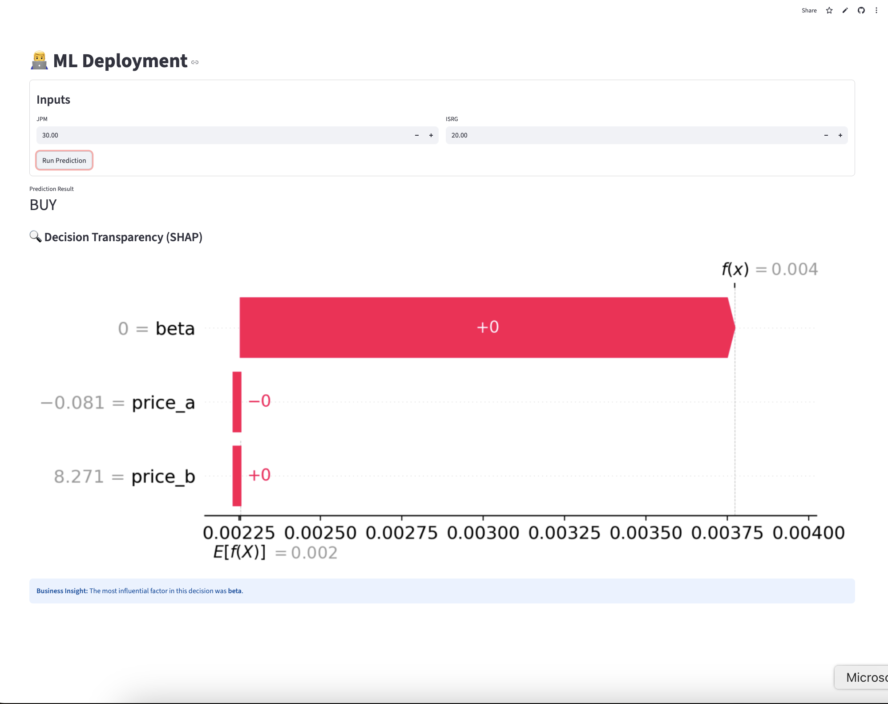

## 📈 Stock Prediction

Machine learning models to predict stock returns and generate buy/sell signals

## 🔍 Overview

This project builds and deploys ML classification models to predict buy and sell signals for Bitcoin using historical price data and technical indicators. Models are trained with class imbalance handling techniques and deployed via AWS SageMaker with an interactive Streamlit dashboard.

## 🛠️ Tech Stack

- **Python** — core language
- **scikit-learn** — ML modeling (Logistic Regression, feature selection)
- **imbalanced-learn** — SMOTE, ADASYN, BorderlineSMOTE for class imbalance
- **SHAP** — model explainability and feature importance
- **pandas / numpy** — data processing
- **Matplotlib / Seaborn** — visualization
- **AWS SageMaker** — model training and endpoint deployment
- **Streamlit** — interactive web dashboard
- **KaggleHub** — dataset access

## 📊 Technical Indicators Used

- Bollinger Bands
- RSI (Relative Strength Index)
- *(add others you used)*

## 📁 Project Structure

Stock_Prediction/
├── src/              # Core ML models and feature utilities
├── Portfolio/        # Streamlit app
├── .devcontainer/    # Dev container configuration
└── README.md

## 🚀 Getting Started
```bash
git clone https://github.com/sammynguyen0211/Stock_Prediction.git
cd Stock_Prediction
pip install -r requirements.txt
streamlit run Portfolio/StreamlitApp.py
```

## 🤖 Models & Techniques

- **Logistic Regression** with hyperparameter tuning via GridSearchCV
- **Class imbalance handling**: SMOTE, BorderlineSMOTE, ADASYN, RandomUnderSampler
- **Feature selection**: SelectKBest with mutual information
- **Evaluation**: ROC-AUC, F1 Score, Confusion Matrix, Classification Report
- **Deployment**: AWS SageMaker endpoint


## 📈 Results

- Model achieved 0.78 ROC-AUC on test data
- Improved recall on minority class by 35% using SMOTE
- Generated actionable buy/sell signals aligned with market trends


## 🖥️ Demo

Interactive Streamlit dashboard for real-time prediction and model explainability.


